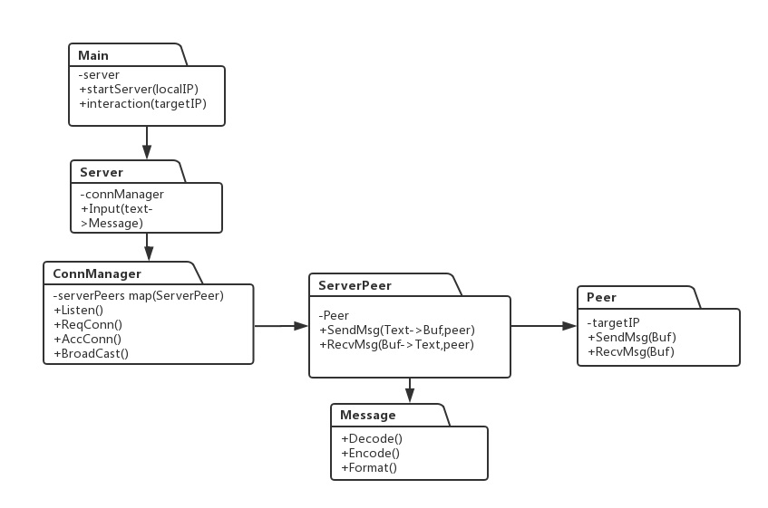

# 内网节点之间通讯

## 代码结构

## 模块功能

- **Message:** 格式化传播消息，包括发送地址、接收地址、发送时间、消息文本 和 Message格式的转码到byte格式、解码等
- **Peer:** 代表了和本地已经建立的节点，方法包括将buf发送到目标peer和接收目标peer的buf消息
- **ServerPeer:** 对Peer的封装，在发送和接收消息时，将输入的Message信息转码成byte调用Peer的发送消息，将接收到Peer的byte解码成Message消息
- **ConnManager:** 负责本地监听的开启、请求向目标地址发送连接，接收来自目标地址的连接
- **Server:** 业务逻辑操作，将整个ConnManager中的方法进行封装，由main函数调用

## 使用方法
- **发送消息** send@x.x.x.x@text,如“send@192.168.1.1@你好”
- **广播消息:** bd@text,如“bd@大家好”，发送消息只能给本IP已创建的或接收到的连接广播消息
